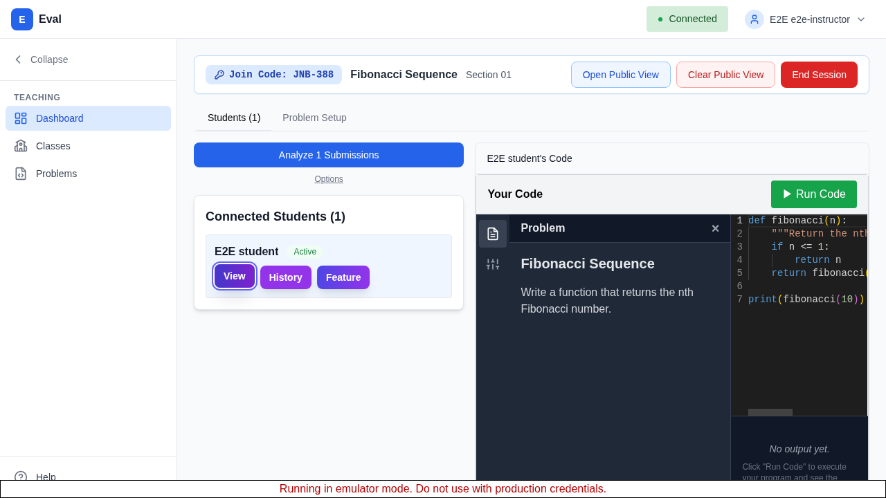
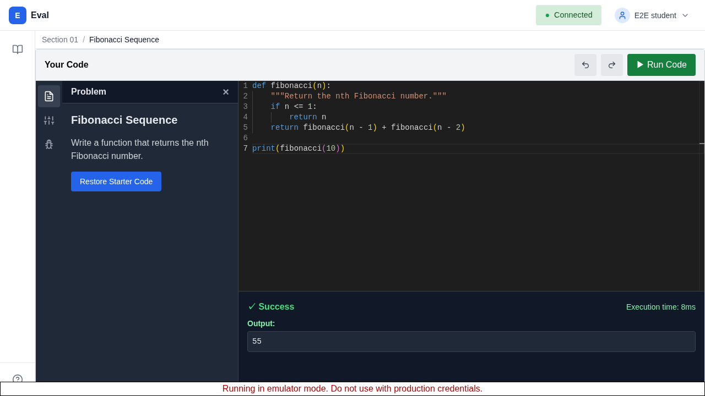

# Coding Exercise Platform

Live coding exercise platform for programming courses.

## Screenshots

<!-- Screenshots are generated by the Playwright screenshot spec (frontend/e2e/screenshots.spec.ts).
     Run `make test-e2e` to produce these images. -->

### Instructor Session View



### Student Coding View



## What It Does

- **Create coding problems** — instructors define problems with test cases and starter code
- **Start live sessions** — launch a session from any problem; students join by session code
- **Students code in-browser** — Monaco editor with sandboxed execution, no local setup required
- **Real-time code visibility** — instructors see all student code updating live during a session
- **Sandboxed execution** — student code runs in isolated nsjail containers; results appear instantly

## Tech Stack

| Layer | Technology |
|-------|------------|
| Backend | Go 1.24 (Chi v5) |
| Frontend | Next.js 16 (App Router), TypeScript, Tailwind CSS |
| Database | PostgreSQL 15 (Cloud SQL) with Row-Level Security |
| Real-time | Centrifugo v5 (WebSocket, Redis-backed) |
| Code Execution | Python executor service, nsjail sandbox, KEDA autoscaling |
| Auth | Google Identity Platform (SAML federation) |
| Infrastructure | GKE, Terraform, Cloud Build |
| CI/CD | GitHub Actions + Google Cloud Build |

## Project Structure

```
go-backend/          # Go API server (see go-backend/CLAUDE.md)
frontend/            # Next.js app (see frontend/CLAUDE.md)
executor/            # Python sandbox execution service (see executor/CLAUDE.md)
migrations/          # SQL migrations (RLS-enabled)
infrastructure/      # Terraform modules and environment configs
k8s/                 # Kubernetes manifests
pkg/                 # Shared Go packages
scripts/             # Development and CI scripts
docs/                # Architecture, design, and workflow docs
```

## Quick Start

```bash
make dev             # Start deps + Go server with hot reload
make test            # Run all unit tests
make lint            # Lint all projects
```

See [docs/LOCAL_DEV.md](docs/LOCAL_DEV.md) for full setup including prerequisites, seed data, and environment configuration.

## Documentation

- **[Architecture](docs/ARCHITECTURE.md)** — System architecture and GCP infrastructure
- **[Local Development](docs/LOCAL_DEV.md)** — Development environment setup
- **[Future Features](docs/FUTURE_FEATURES.md)** — Planned capabilities (out-of-class assignments, AI-assisted grading, multi-language support)
- **[Future Design](docs/FUTURE_DESIGN.md)** — Technical design for planned features
- **[Economics](docs/ECONOMICS.md)** — Hosting costs and per-student cost projections

## Status

Under active development. See [beads issues](.beads/) for current work tracking.
